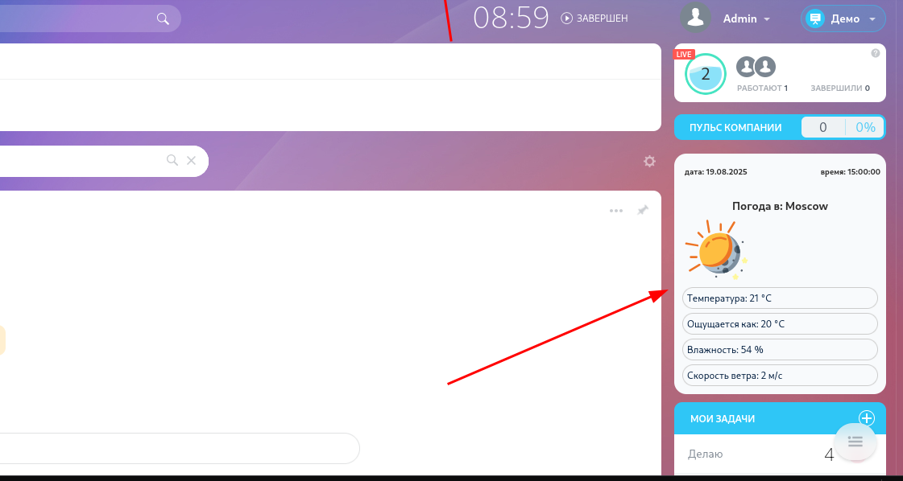
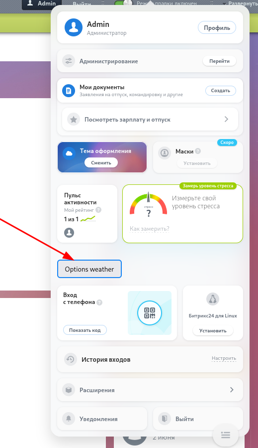
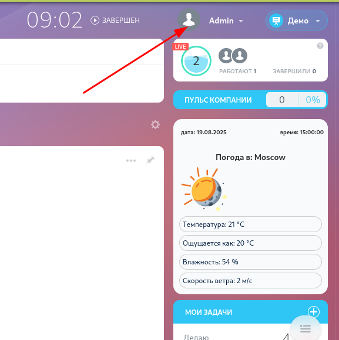
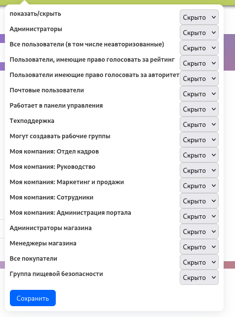

# Bitrix24 Виджет Погоды от Яндекс

Этот компонент отображает **текущую погоду** в виде красивого **виджета в ленте новостей Bitrix24**, используя [API Яндекс.Погоды](https://yandex.ru/pogoda/b2b/console/api-page).

##  Возможности

-  Температура 
-  ощущается как
-  Влажность
-  Скорость ветра
-  Актуальная дата и время
---

## Установка

1. Установи зависимости:
   ```bash
   composer install
   ```

2. Получи ключ API:
   - Зарегистрируйся: [API Яндекс.Погоды](https://yandex.ru/pogoda/b2b/console/api-page)

3. Настрой `.env` файл:
   ```dotenv
   API_YANDEX_KEY=YOUR_YANDEX_WEATHER_TOKEN
   ```

---

##  Интерфейс

### Виджет на ленте Bitrix24



###  Админ-панель настройки

| Настройки  | Скриншоты                                             |
|------------|-------------------------------------------------------|
| Где находится кнопка настройки      |  ,  |
| Всплывающее окно с настройками доступа    |                              |

---

##  Структура

- `/local/components/widgets/weather-yandex/` — компонент Bitrix
- `/img-readme/` — скриншоты для документации
- `.env` — переменные окружения
- `composer.json` — зависимости
---

